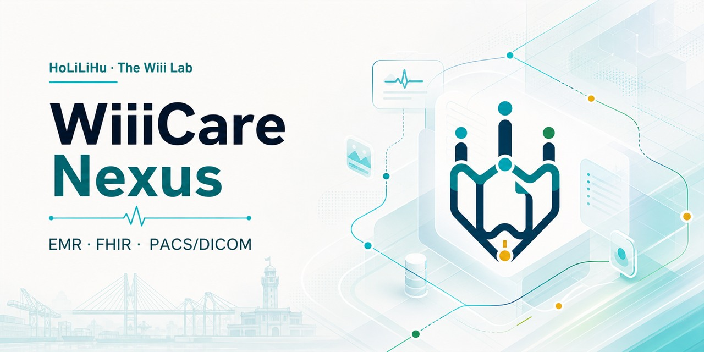
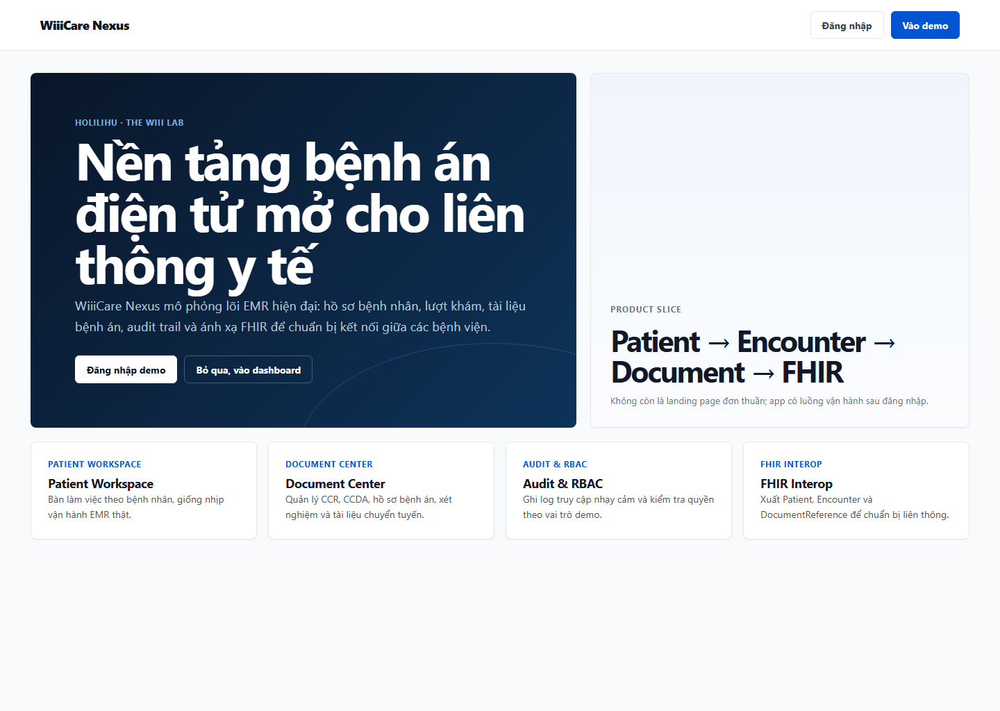
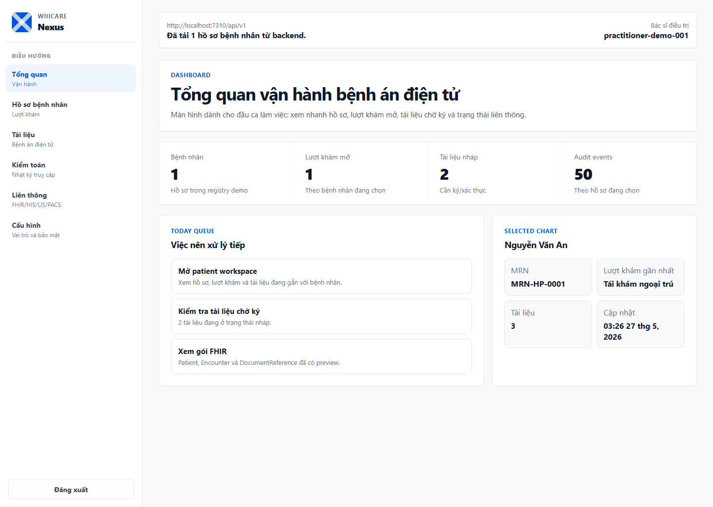

# WiiiCare Nexus



**WiiiCare Nexus** là dự án nền tảng bệnh viện số do **HoLiLiHu** thuộc **The Wiii Lab** phát triển, tập trung vào hồ sơ bệnh án điện tử, liên thông dữ liệu y tế và kiến trúc mở cho EMR/FHIR/PACS.

Mục tiêu trước mắt là tạo một nền tảng monorepo đủ rõ ràng để trình bày, thử nghiệm và mở rộng; chưa giả định đây là phần mềm đạt điều kiện triển khai sản xuất tại bệnh viện.

Brand assets: [docs/BRAND.md](docs/BRAND.md).

## Định hướng kiến trúc

- Bắt đầu bằng **modular monolith theo DDD** để giữ tốc độ phát triển, giảm chi phí vận hành và vẫn có ranh giới nghiệp vụ rõ.
- Thiết kế các bounded context có thể tách thành microservice khi lưu lượng, đội ngũ hoặc yêu cầu triển khai thật sự cần.
- Lấy **HL7 FHIR R4** làm ngôn ngữ trao đổi dữ liệu y tế, **DICOM** cho ảnh y khoa, và các hồ sơ IHE như **MHD/PIXm** cho hướng liên thông tài liệu và định danh bệnh nhân.
- Ưu tiên bảo mật theo “least privilege”, nhật ký kiểm toán, phân quyền theo vai trò và sẵn sàng ký/xác nhận điện tử theo yêu cầu pháp lý.

## Cấu trúc chính

```text
apps/
  api/      API nghiệp vụ, FHIR facade và điểm tích hợp
  web/      Giao diện demo để giải thích luồng bệnh án điện tử
packages/
  domain/   Mô hình nghiệp vụ lõi theo DDD
  contracts/ Schema request/response dùng chung
infra/      Docker Compose cho hạ tầng thử nghiệm, không tự bật
docs/       Kiến trúc, chuẩn tham chiếu, quyết định kỹ thuật, roadmap
migrations/ SQL migration cho PostgreSQL
```

## Luồng giao diện hiện có

Ứng dụng web hiện đã có luồng sản phẩm đầy đủ hơn thay vì chỉ một trang demo:

- `Landing`: giới thiệu WiiiCare Nexus, định vị EMR/FHIR và điều hướng vào phiên demo.
- `Login`: đăng nhập demo phát Bearer token nội bộ cho vai trò bác sĩ, điều dưỡng, kiểm toán, quản trị hoặc gateway liên thông; đây chưa phải IAM/SSO sản xuất.
- `Dashboard`: tổng quan số hồ sơ, lượt khám đang mở, dị ứng/cảnh báo, chẩn đoán/vấn đề sức khỏe, chỉ định dịch vụ, công việc thực thi, chỉ định thuốc, cấp phát thuốc, dùng thuốc thực tế, tài liệu nháp và hàng chờ thao tác.
- `Patient Workspace`: chọn bệnh nhân, xem định danh, mở/kết thúc lượt khám, ghi nhận dị ứng/cảnh báo, chẩn đoán, chỉ định xét nghiệm/hình ảnh/thủ thuật, theo dõi công việc thực thi y lệnh, ghi nhận thủ thuật/hoạt động đã thực hiện, chỉ số sinh hiệu/xét nghiệm, chỉ định thuốc, cấp phát thuốc, xác nhận dùng thuốc thực tế, tạo tài liệu và xem FHIR theo hồ sơ.
- `Documents`: quản lý tài liệu bệnh án theo nhóm CCD/CCDA/CCR, lab report, medical record và referral.
- `Audit`: xem nhật ký thao tác nhạy cảm theo bệnh nhân, actor, mục đích sử dụng, tài nguyên, kiểm tra toàn vẹn chuỗi băm audit và xuất FHIR `AuditEvent` Bundle cho kiểm toán viên.
- `Interop`: kiểm tra FHIR `CapabilityStatement`, `Patient`, `Organization`, `Practitioner`, `PractitionerRole`, `Endpoint`, `Consent`, `Encounter`, `AllergyIntolerance`, `Condition`, `ServiceRequest`, `Task`, `Procedure`, `Observation`, `DiagnosticReport`, `ImagingStudy`, `MedicationRequest`, `MedicationDispense`, `MedicationAdministration`, `DocumentReference`, `Provenance`, `Composition`, `Bundle`, consent chia sẻ hồ sơ, thu hồi consent, gói chuyển hồ sơ liên viện và các hướng mở sang HIS/LIS/PACS.
- `Gateway`: khi đăng nhập bằng vai trò `integration`, giao diện chuyển sang màn callback tiếp nhận riêng, dùng `x-purpose-of-use=OPERATIONS` để mô phỏng gateway bệnh viện nhận gửi biên nhận kỹ thuật cho gói chuyển hồ sơ.
- `Settings`: mô tả quyền demo, cấu hình vận hành và các việc cần thay bằng bảo mật thật khi lên production.

## Ảnh kiểm thử giao diện





## Chạy kiểm tra

```bash
pnpm install
pnpm run ci
```

Khi cần chạy API sau khi đã cài dependency:

```bash
pnpm dev:api
```

Hạ tầng trong `infra/docker-compose.yml` chỉ là môi trường thí nghiệm. Không nên bật toàn bộ khi chưa xác định rõ mục tiêu demo.

## Docker dev/prod

```bash
docker compose --env-file .env.dev.example -f docker-compose.yml -f docker-compose.dev.yml up -d --build
```

Nếu cần bật thêm FHIR server và PACS:

```bash
docker compose --env-file .env.dev.example -f docker-compose.yml -f docker-compose.dev.yml --profile interop --profile imaging up -d --build
```

Chi tiết xem [docs/runbooks/DOCKER.md](docs/runbooks/DOCKER.md).

Ở cấu hình prod-like, chỉ web edge được publish ra host; API nằm trên mạng nội bộ compose và được truy cập qua reverse proxy `/api/v1` hoặc health/readiness nội bộ của container.

## Backend và cơ sở dữ liệu

Backend hiện dùng Fastify + TypeScript. Trong Docker, API chạy với `BVS_REPOSITORY=postgres`, migration service tạo schema PostgreSQL trước khi API khởi động. Các bảng nền tảng gồm `patients`, `encounters`, `allergy_intolerances`, `conditions`, `service_requests`, `workflow_tasks`, `procedures`, `observations`, `diagnostic_reports`, `imaging_studies`, `medication_requests`, `medication_dispenses`, `medication_administrations`, `clinical_documents`, `consents`, `record_transfers`, `record_transfer_delivery_attempts`, `provider_directory_resources`, `audit_events` và `schema_migrations`. Bảng `clinical_documents` lưu thêm metadata tệp đính kèm như MIME type, dung lượng, SHA-1 Base64 và thời điểm tạo tệp để xuất sang FHIR `DocumentReference.content.attachment`. Bảng `consents` có metadata thu hồi để chặn các lần xuất/chuyển hồ sơ mới sau khi người bệnh rút lại đồng ý. Bảng `record_transfers` lưu lỗi gửi, lịch thử lại, số lần retry, thời điểm đưa vào hàng lỗi cuối, người xác nhận nhận hồ sơ và mã biên nhận tiếp nhận; API chỉ cho tạo/gửi gói chuyển khi đơn vị nhận có endpoint FHIR REST đang hoạt động và hỗ trợ `Bundle` trong Provider Directory. Mỗi lần gọi gửi tạo một bản ghi `record_transfer_delivery_attempts` ở dạng outbox/hàng chờ với endpoint đích, FHIR Bundle, số lần thử và idempotency key; delivery worker `BVS_RECORD_TRANSFER_DELIVERY_WORKER_ENABLED=true` có thể dựng FHIR Bundle theo consent rồi POST sang endpoint FHIR đích, cập nhật attempt `succeeded/failed` và đưa `RecordTransfer` lỗi vào lịch retry. Worker retry `BVS_RECORD_TRANSFER_RETRY_WORKER_ENABLED=true` đưa các gói lỗi đã đến hạn về hàng đợi gửi lại hoặc chuyển sang `dead-lettered` khi vượt `BVS_RECORD_TRANSFER_RETRY_WORKER_MAX_RETRY_COUNT`. Bảng vận hành không lưu bản sao đầy đủ của Bundle. Bảng `audit_events` có thêm chuỗi băm `sha256` để phát hiện sửa/xóa log ở mức prototype và có thể xuất thành FHIR `AuditEvent` Bundle cho kiểm toán.

API có `/health` cho liveness, `/ready` cho readiness và `/api/v1/runtime` cho metadata tương thích web như phiên bản API, public base URL và thời điểm kiểm tra. Các diagnostics vận hành nhạy cảm hơn như repository, môi trường, giới hạn body HTTP, trạng thái bật/tắt tài liệu API và worker chuyển hồ sơ chỉ trả về cho phiên admin/auditor có `PurposeOfUse` phù hợp. `/ready` kiểm tra API đọc được repository bệnh nhân và Provider Directory trước khi container được xem là sẵn sàng nhận traffic.

Định danh bệnh nhân được xem như một ranh giới Patient Registry/MPI tối thiểu: một CCCD/BHYT/MRN không được gán cho nhiều hồ sơ khác nhau. PostgreSQL duy trì bảng `patient_identifier_index` với unique constraint theo `system + value`; API trả `409 PATIENT_IDENTIFIER_CONFLICT` khi phát hiện trùng để buộc đi qua quy trình đối soát thay vì tạo hồ sơ mới.

Khi đã xác nhận hai hồ sơ là cùng một người bệnh, endpoint `POST /api/v1/patients/:id/merge` cho phép quản trị viên đánh dấu hồ sơ nguồn đã nhập vào hồ sơ đích, lưu người thực hiện, lý do và thời điểm merge. FHIR `Patient` của hồ sơ nguồn được xuất với `active=false` và `link.type=replaced-by` trỏ tới hồ sơ đích để bên nhận biết hồ sơ này không còn là bản chính.

Sau khi merge, hồ sơ nguồn được giữ ở chế độ tham chiếu: các request đọc/xuất FHIR vẫn hoạt động để phục vụ truy vết, nhưng request ghi qua các route bệnh án theo `patientId` bị chặn với `409 PATIENT_RECORD_MERGED`. Dữ liệu lâm sàng mới phải đi vào hồ sơ đích.

Khi chạy local không Docker, có thể dùng in-memory repository để phát triển nhanh; khi cần kiểm chứng sát thực tế, dùng Docker dev/prod để chạy PostgreSQL. Ở `NODE_ENV=production`, API bắt buộc `BVS_REPOSITORY=postgres` để tránh chạy dữ liệu bệnh án trên store demo trong RAM.

API nghiệp vụ yêu cầu đăng nhập qua `POST /api/v1/auth/login` và gửi `Authorization: Bearer <token>`. Biến `BVS_AUTH_SECRET` phải dài tối thiểu 32 ký tự; ở `NODE_ENV=production`, API sẽ từ chối khởi động nếu thiếu secret hợp lệ. Callback xác nhận nhận hồ sơ có thêm lớp chữ ký `HMAC-SHA256`: production nên dùng `BVS_RECORD_TRANSFER_CALLBACK_SECRETS_JSON` để ánh xạ từng gateway key id sang secret riêng; fallback một gateway là `BVS_RECORD_TRANSFER_CALLBACK_SECRET`. Ở production, API cũng từ chối khởi động nếu thiếu secret callback hợp lệ hoặc secret còn là placeholder/dev-only. Khi dùng secret map, gateway nhận phải gửi thêm `x-wiiicare-callback-key-id`; mọi callback đã ký đều phải có `x-wiiicare-callback-timestamp` và `x-wiiicare-callback-signature` hợp lệ trong cửa sổ 5 phút. `BVS_HTTP_BODY_LIMIT_BYTES` giới hạn request body JSON, mặc định `1048576` byte và chỉ nhận giá trị từ `1024` đến `10485760` byte; tài liệu/ảnh thật nên đi qua object storage thay vì nhồi binary lớn vào API metadata. `BVS_PUBLIC_API_BASE_URL` cũng bắt buộc dùng URL HTTPS public, không phải `localhost`, loopback, private IP hoặc link-local IP, để FHIR `CapabilityStatement` không công bố nhầm endpoint nội bộ. Tương tự, endpoint FHIR nhận hồ sơ trong Provider Directory bị chặn ở production nếu không dùng HTTPS hoặc trỏ về localhost/loopback; lớp kiểm tra này chạy ở cả API tạo/gửi `RecordTransfer` và delivery worker trước khi POST Bundle. Đăng nhập demo mặc định bị tắt trong production và chỉ được bật có chủ đích bằng `BVS_DEMO_AUTH_ENABLED=true` cho phiên smoke/demo có kiểm soát. Swagger UI/OpenAPI docs tại `/docs` mặc định bật ngoài production, nhưng mặc định tắt trong production; chỉ đặt `BVS_API_DOCS_ENABLED=true` khi tài liệu API được đặt sau mạng nội bộ hoặc lớp kiểm soát truy cập phù hợp.

## GitHub và release

Repo đã được chuẩn bị cho GitHub Actions:

- CI: TypeScript check, test, build, harness smoke và Docker smoke.
- Release: tag `v*.*.*` sẽ build/push image API và web lên GHCR.
- Dependabot: kiểm tra npm, Dockerfile và GitHub Actions hằng tuần.
- Review context: `.coderabbit.yaml`, `AGENTS.md`, `CLAUDE.md`.

Chi tiết version xem [VERSIONING.md](VERSIONING.md).

## Phạm vi phiên bản đầu

- Quản lý hồ sơ bệnh nhân tối thiểu.
- Quản lý lượt khám/đợt điều trị tối thiểu để tài liệu bệnh án có ngữ cảnh lâm sàng.
- Xuất biểu diễn bệnh nhân sang FHIR `Patient`.
- Xuất lượt khám sang FHIR `Encounter`.
- Quản lý dị ứng/cảnh báo an toàn lâm sàng và xuất sang FHIR `AllergyIntolerance`.
- Quản lý chẩn đoán/vấn đề sức khỏe có cấu trúc và xuất sang FHIR `Condition`.
- Quản lý chỉ định xét nghiệm/chẩn đoán hình ảnh/thủ thuật và xuất sang FHIR `ServiceRequest`.
- Quản lý hàng đợi/công việc thực thi y lệnh và xuất sang FHIR `Task`, nối `ServiceRequest` với kết quả đầu ra như `Observation`, `DiagnosticReport` hoặc `ImagingStudy`.
- Quản lý thủ thuật/hoạt động y tế đã thực hiện và xuất sang FHIR `Procedure`, nối lại y lệnh gốc, người thực hiện, thời gian thực hiện, vị trí cơ thể, kết quả thủ thuật và báo cáo liên quan.
- Quản lý chỉ số sinh hiệu/xét nghiệm có cấu trúc và xuất sang FHIR `Observation`.
- Quản lý báo cáo kết quả xét nghiệm/chẩn đoán hình ảnh và xuất sang FHIR `DiagnosticReport`, có thể nối `basedOn` tới `ServiceRequest` và `result` tới `Observation`.
- Quản lý metadata ảnh y khoa/PACS tối thiểu và xuất sang FHIR `ImagingStudy`, gồm DICOM Study Instance UID, Accession Number, modality, series, số ảnh, vùng chụp và endpoint PACS/DICOMweb.
- Quản lý chỉ định thuốc/đơn thuốc tối thiểu và xuất sang FHIR `MedicationRequest`.
- Quản lý cấp phát thuốc từ khoa dược/kho thuốc và xuất sang FHIR `MedicationDispense`, nối lại chỉ định thuốc gốc, lượt khám, số lượng cấp, số ngày cấp, thời điểm chuẩn bị/bàn giao, người cấp phát và người nhận thuốc.
- Quản lý lần dùng thuốc thực tế và xuất sang FHIR `MedicationAdministration`, nối lại chỉ định thuốc gốc, lượt khám, chẩn đoán/lý do, người xác nhận, thời điểm dùng và liều thực tế.
- Quản lý tài liệu bệnh án tối thiểu: tạo bản nháp, lưu metadata tệp đính kèm, ký tài liệu, xuất metadata sang FHIR `DocumentReference` có `contentType`/`size`/`hash`/`creation` và xuất FHIR `Provenance` cho tài liệu đã ký để mô tả người chịu trách nhiệm, thời điểm ký/xác nhận và nguồn tài liệu.
- Quản lý consent chia sẻ hồ sơ tối thiểu, gồm lưu consent theo bệnh nhân, đơn vị nhận, thời hạn hiệu lực, thu hồi consent khi người bệnh rút lại đồng ý và xuất biểu diễn FHIR `Consent`.
- Quản lý gói chuyển hồ sơ liên viện tối thiểu bằng `RecordTransfer`, kiểm consent trước khi tạo, nối cơ sở gửi/nhận, loại FHIR Bundle, lý do chuyển, trạng thái vận hành `requested/ready → in-progress → failed → ready/dead-lettered → completed`, tạo `record_transfer_delivery_attempts` có idempotency key cho từng lần gửi, lưu người xác nhận nhận hồ sơ và mã biên nhận tiếp nhận, hỗ trợ callback acknowledgement bằng role hẹp `integration`, `x-purpose-of-use=OPERATIONS` và chữ ký `HMAC-SHA256` khi bật secret, hiển thị lịch sử gửi ngay trên UI Interop, delivery worker POST FHIR Bundle khi được bật, worker retry có kiểm soát và xuất sang FHIR `Task` điều phối có `executionPeriod`.
- Quản lý Provider Directory tối thiểu gồm cơ sở y tế/khoa phòng, nhân sự, vai trò nhân sự và endpoint liên thông FHIR/LIS/PACS; xuất sang FHIR `Organization`, `Practitioner`, `PractitionerRole`, `Endpoint`.
- Ghi audit trail cho thao tác nhạy cảm, kiểm tra toàn vẹn chuỗi băm theo từng bệnh nhân qua API `/api/v1/patients/:patientId/audit-integrity` và xuất FHIR `AuditEvent` Bundle cho mục đích kiểm toán.
- Công bố FHIR `CapabilityStatement` tại `/api/v1/fhir/metadata` để mô tả facade đang hỗ trợ resource R4 nào, endpoint triển khai và giả định bảo mật của prototype, gồm cả `Provenance` cho nguồn gốc tài liệu đã ký.
- Xuất gói hồ sơ bệnh nhân sang FHIR `Bundle` dạng `collection` gồm Patient, Provider Directory resources, Consent, Encounter, AllergyIntolerance, Condition, ServiceRequest, Task, Procedure, Observation, DiagnosticReport, ImagingStudy, MedicationRequest, MedicationDispense, MedicationAdministration và DocumentReference; API chỉ cho xuất khi consent còn hiệu lực, chưa bị thu hồi và khớp đơn vị nhận.
- Xuất gói tài liệu bệnh án sang FHIR `Bundle` dạng `document`, có `Composition` là entry đầu tiên để đóng vai trò mục lục lâm sàng cho hồ sơ chuyển viện/liên viện.
- Ghi nhật ký kiểm toán tối thiểu cho các thao tác xem/tạo/ký/xuất dữ liệu nhạy cảm.
- Chặn quyền tối thiểu ở API theo vai trò demo `clinician`, `nurse`, `auditor`, `admin`; Patient Registry có thêm ABAC theo tổ chức điều trị trong Provider Directory.
- Chuẩn bị đường mở rộng sang hồ sơ lâm sàng, hình ảnh y khoa và liên thông bệnh viện.
- Tài liệu hóa các quyết định kiến trúc để dễ bảo vệ trước thầy hoặc mở rộng thành đề tài lớn hơn.
