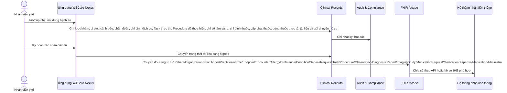

# Kiến trúc hệ thống

## Mục tiêu

Dự án hướng tới một nền tảng bệnh án điện tử có thể giải thích rõ trong bối cảnh học thuật, đồng thời đủ thực tế để mở rộng thành hệ thống thí nghiệm nghiêm túc. Trọng tâm không phải là “làm một HIS hoàn chỉnh ngay lập tức”, mà là xây phần lõi EMR/EHR có khả năng liên thông với HIS, LIS, PACS và các hệ thống bên ngoài.

## Lựa chọn kiến trúc khởi đầu

Kiến trúc khởi đầu là **modular monolith theo DDD**. Lý do:

- Dự án còn ở giai đoạn khám phá, chưa nên trả chi phí vận hành của microservice quá sớm.
- Ranh giới nghiệp vụ vẫn được tách rõ để sau này có thể tách service.
- Giao tiếp nội bộ trước mắt dùng module boundary trong mã nguồn; giao tiếp liên thông bên ngoài dùng API và chuẩn FHIR.
- Các thành phần hạ tầng như HAPI FHIR, Orthanc, PostgreSQL, Redis/Valkey và MinIO được để trong `infra/` như môi trường thử nghiệm, không tự bật.

## Bounded context

| Context | Vai trò | Có thể tách service khi nào |
| --- | --- | --- |
| Identity & Access | Người dùng, vai trò, quyền truy cập, phiên đăng nhập | Khi cần SSO, tích hợp định danh ngoài hoặc nhiều ứng dụng dùng chung |
| Patient Registry | Hồ sơ hành chính, định danh bệnh nhân, đối soát mã bệnh nhân | Khi cần liên thông nhiều bệnh viện hoặc master patient index |
| Provider Directory | Danh bạ cơ sở y tế, khoa/phòng, nhân sự, vai trò và endpoint FHIR/LIS/PACS | Khi cần đồng bộ danh mục cơ sở, nhiều bệnh viện/khoa phòng hoặc tích hợp HIE quốc gia/khu vực |
| Clinical Records | Bệnh án, chẩn đoán, y lệnh, diễn biến, tài liệu lâm sàng | Khi khối lượng tài liệu và quy trình ký/xác nhận tăng |
| Workflow | Hàng đợi thực thi y lệnh, trạng thái nhận mẫu/chụp ảnh/trả kết quả, chủ sở hữu công việc | Khi cần orchestration thật, worker LIS/PACS/RIS hoặc engine BPMN/event queue |
| Consent & Sharing | Consent chia sẻ hồ sơ, thu hồi consent, gói chuyển hồ sơ liên viện, đơn vị nhận, thời hạn hiệu lực và căn cứ xuất dữ liệu | Khi có nhiều chính sách chia sẻ, nhiều bệnh viện nhận hoặc cần đồng bộ consent từ hệ thống ngoài |
| Interoperability | FHIR facade, mapping dữ liệu, luồng gửi/nhận tài liệu | Khi kết nối nhiều chuẩn và nhiều đối tác |
| Imaging | Tích hợp PACS, DICOM/DICOMweb, báo cáo hình ảnh | Khi dữ liệu ảnh lớn hoặc cần quản trị riêng |
| Audit & Compliance | Nhật ký truy cập, nhật ký chỉnh sửa, xuất FHIR `AuditEvent`, báo cáo tuân thủ | Khi có yêu cầu kiểm toán độc lập |

## Sơ đồ tổng quan

## Luồng bệnh án điện tử ở mức khái niệm

## Nguyên tắc dữ liệu

- **Không coi FHIR là database nội bộ duy nhất.** FHIR là lớp trao đổi và liên thông; domain model vẫn giữ ngữ nghĩa nghiệp vụ của hệ thống.
- **PostgreSQL là hệ quản trị dữ liệu nghiệp vụ chính.** Dữ liệu lõi như bệnh nhân, tài liệu lâm sàng và audit trail được quản lý bằng migration SQL, không phụ thuộc vào dữ liệu demo trong bộ nhớ.
- **Không coi một mã bệnh nhân là đủ.** Cần quản lý nhiều định danh: mã bệnh viện, số định danh cá nhân, mã bảo hiểm y tế, mã hệ thống cũ.
- **Tài liệu phải đi qua ngữ cảnh lượt khám/đợt điều trị khi có thể.** OpenEMR cho thấy tài liệu rời rạc khó sử dụng nếu không bám vào patient chart và encounter timeline.
- **Dị ứng/cảnh báo an toàn phải nổi bật trước luồng thuốc.** Tối thiểu cần tác nhân, nhóm, mức cảnh báo, trạng thái xác minh, biểu hiện phản ứng và người ghi nhận.
- **Chẩn đoán/vấn đề sức khỏe cần tách khỏi ghi chú tự do.** Tối thiểu cần mã chuẩn, trạng thái lâm sàng, trạng thái xác minh, mức độ, người ghi nhận và liên kết bệnh nhân/lượt khám khi có thể.
- **Chỉ định dịch vụ là cầu nối tới LIS/PACS/RIS.** Xét nghiệm, chẩn đoán hình ảnh, thủ thuật và hội chẩn cần có y lệnh riêng trước khi kết quả về; tối thiểu cần mã dịch vụ, nhóm dịch vụ, ưu tiên, người chỉ định, khoa thực hiện, thời điểm dự kiến và chẩn đoán liên quan khi có.
- **Task là lớp theo dõi thực thi, không phải y lệnh mới.** `ServiceRequest` nói “cần làm gì”; `Task` nói “ai đang xử lý, trạng thái đến đâu, đầu ra nào đã sinh ra”. Đây là lớp cần thiết để nối EMR với hàng đợi LIS/PACS/RIS mà không trộn trạng thái vận hành vào y lệnh.
- **Procedure là bản ghi hành động đã thực hiện, không phải hàng đợi.** `ServiceRequest` là y lệnh, `Task` là trạng thái vận hành, còn `Procedure` là bằng chứng lâm sàng rằng thủ thuật/hoạt động đã diễn ra, ai thực hiện, thời điểm nào, kết quả gì và báo cáo nào liên quan.
- **Vòng thuốc phải tách ba bước.** `MedicationRequest` là chỉ định/kế hoạch dùng thuốc; `MedicationDispense` là sự kiện khoa dược/kho thuốc đã cấp phát thuốc, số lượng và thời điểm bàn giao; `MedicationAdministration` là sự kiện thuốc đã được dùng hoặc được xác nhận dùng, có thời điểm, liều thực tế và người/thiết bị xác nhận.
- **Chỉ số lâm sàng cần có cấu trúc máy đọc được.** Sinh hiệu và xét nghiệm không nên chỉ nằm trong PDF; tối thiểu cần mã chuẩn, giá trị, đơn vị, thời điểm, người ghi nhận và liên kết bệnh nhân/lượt khám.
- **Chỉ định thuốc cần tách khỏi văn bản tự do trong tài liệu.** Tối thiểu cần mã thuốc, hướng dẫn dùng, người kê, trạng thái, mục đích, liên kết bệnh nhân/lượt khám và chẩn đoán liên quan khi có thể.
- **Tài liệu bệnh án cần có vòng đời và nguồn gốc.** Tối thiểu gồm nháp, đã ký, bị thay thế, nhập sai; khi tài liệu đã ký, lớp FHIR nên có `DocumentReference` để mô tả tài liệu và `Provenance` để mô tả ai ký/xác nhận, khi nào và nguồn tài liệu nào được dùng. `Provenance` không tự biến thành chữ ký số pháp lý nếu chưa có hạ tầng ký số thật.
- **Chia sẻ hồ sơ cần consent có trạng thái và thời hạn.** FHIR Bundle liên viện không được xuất chỉ vì người dùng có role điều trị; phải có consent khớp bệnh nhân, đơn vị nhận và thời điểm truy cập. Consent đã bị thu hồi phải chặn các lần xuất hoặc chuyển hồ sơ mới; khi đóng gói FHIR, consent liên quan cần xuất thành resource `Consent` để tránh reference treo.
- **Gói chuyển hồ sơ là workflow, không phải bản sao dữ liệu lâm sàng.** `RecordTransfer` giữ trạng thái gửi/nhận/lỗi/thử lại/hàng lỗi cuối, cơ sở gửi/nhận, consent, lý do chuyển, `bundleId`, người xác nhận nhận và mã biên nhận tiếp nhận; đơn vị nhận phải có endpoint FHIR REST hỗ trợ `Bundle` trong Provider Directory trước khi tạo/gửi gói. Mỗi lần gửi tạo một `RecordTransferDeliveryAttempt` dạng outbox với endpoint đích, `bundleId`, số lần thử và idempotency key. Delivery worker, khi được bật, dựng FHIR Bundle theo consent rồi POST sang endpoint đích, cập nhật attempt `succeeded/failed`, ghi audit vận hành và chỉ đưa `RecordTransfer` sang `failed` khi gửi thật sự lỗi. Retry worker đưa gói lỗi đã đến hạn về hàng đợi `ready` hoặc chuyển sang `dead-lettered` khi quá trần retry, đồng thời ghi audit `record-transfer.retry`/`record-transfer.dead-letter`; worker không tự đánh dấu bên nhận đã nhận hồ sơ. Khi bên nhận xác nhận thủ công hoặc gửi callback acknowledgement hợp lệ, hệ thống lưu `receivedByActorId` và `acknowledgementReference` để làm biên nhận kỹ thuật tối thiểu. Callback yêu cầu quyền `record-transfer:acknowledge`, `x-purpose-of-use=OPERATIONS` và tổ chức callback khớp cơ sở nhận hoặc tài khoản vận hành hệ thống. Khi xuất chuẩn, `RecordTransfer` thành FHIR `Task` trỏ tới `Bundle`, không nhân đôi toàn bộ hồ sơ bệnh án.
- **Gói bệnh án chuyển viện cần Composition.** `Bundle.type = collection` phù hợp để gom dữ liệu thô; khi cần biểu diễn một tài liệu bệnh án có cấu trúc, dùng `Bundle.type = document` và đặt `Composition` làm entry đầu tiên để mô tả mục lục lâm sàng.
- **Không để reference FHIR bị treo.** Khi `Patient`, `Encounter`, `DiagnosticReport` hoặc `ImagingStudy` tham chiếu `Organization`, `Practitioner`, `PractitionerRole` hoặc `Endpoint`, gói liên thông cần có Provider Directory tối thiểu để bên nhận hiểu cơ sở quản lý, khoa thực hiện, người phụ trách và endpoint PACS/FHIR/LIS.
- **Ảnh y khoa đi theo chuẩn riêng.** Ảnh X-quang, CT, MRI, siêu âm nên đi qua PACS/DICOM, không nhồi trực tiếp vào bảng bệnh án. EMR chỉ lưu metadata `ImagingStudy` như DICOM Study Instance UID, Accession Number, modality, series, số ảnh, vùng chụp và endpoint PACS/DICOMweb.
- **Mọi truy cập nhạy cảm cần kiểm toán và kiểm tra toàn vẹn.** Bệnh án là dữ liệu đặc biệt nhạy cảm, không thể thiếu audit trail. Mỗi `AuditEvent` mới được niêm phong bằng `sha256` theo chuỗi băm để phát hiện sửa/xóa log ở mức prototype; khi cần trao đổi với lớp kiểm toán/liên thông, audit có thể xuất thành FHIR `AuditEvent` Bundle. Triển khai thật vẫn cần cơ chế lưu trữ bất biến, chính sách giữ log và giám sát độc lập.

## Lược đồ dữ liệu nền tảng

Phiên bản hiện tại tạo các bảng tối thiểu:

- `patients`: hồ sơ hành chính và định danh bệnh nhân, dùng `jsonb` cho nhiều định danh.
- `encounters`: lượt khám hoặc đợt điều trị, là cầu nối giữa bệnh nhân, tài liệu, người phụ trách và FHIR Encounter.
- `allergy_intolerances`: dị ứng/cảnh báo an toàn có cấu trúc, gồm tác nhân, nhóm, mức cảnh báo, phản ứng, thời điểm và người ghi nhận.
- `conditions`: chẩn đoán/vấn đề sức khỏe có cấu trúc, gồm trạng thái, mã chẩn đoán, mức độ, thời điểm ghi nhận và người ghi nhận.
- `service_requests`: chỉ định dịch vụ có cấu trúc, gồm nhóm dịch vụ, mã dịch vụ, ưu tiên, khoa thực hiện, thời điểm dự kiến và người chỉ định.
- `workflow_tasks`: hàng đợi/công việc thực thi y lệnh, gồm trạng thái FHIR Task, trạng thái nghiệp vụ, chủ sở hữu, thời gian xử lý, input và output tham chiếu.
- `procedures`: thủ thuật/hoạt động y tế đã thực hiện, gồm trạng thái FHIR Procedure, y lệnh gốc, thời gian thực hiện, người/khoa thực hiện, body site, outcome và báo cáo liên quan.
- `observations`: sinh hiệu/xét nghiệm có cấu trúc, gồm mã chuẩn, giá trị định lượng hoặc văn bản, thời điểm và người ghi nhận.
- `diagnostic_reports`: báo cáo kết quả xét nghiệm/hình ảnh, nối y lệnh `service_requests` với các `observations` nguyên tử hoặc báo cáo dạng tệp.
- `imaging_studies`: metadata ảnh y khoa/PACS, gồm Study Instance UID, Accession Number, modality, series, số ảnh, vùng chụp và endpoint PACS/DICOMweb; ảnh thật vẫn nằm ngoài EMR.
- `medication_requests`: chỉ định thuốc/đơn thuốc có cấu trúc, gồm mã thuốc, liều dùng, người kê, thời điểm, trạng thái và liên kết chẩn đoán khi có.
- `medication_dispenses`: cấp phát thuốc theo FHIR `MedicationDispense`, gồm chỉ định thuốc gốc, số lượng cấp, số ngày cấp, thời điểm chuẩn bị/bàn giao, người cấp phát và người nhận thuốc.
- `medication_administrations`: lần dùng thuốc thực tế, gồm trạng thái, thuốc, liều thực tế, thời điểm, người/thiết bị xác nhận và liên kết tới `medication_requests` khi có.
- `clinical_documents`: tài liệu lâm sàng có vòng đời nháp, đã ký, bị thay thế hoặc nhập sai.
- `consents`: consent chia sẻ hồ sơ theo bệnh nhân, đơn vị nhận, trạng thái, thời hạn hiệu lực, người thu hồi, thời điểm thu hồi và lý do thu hồi nếu có; xuất sang FHIR `Consent` khi cần giải nghĩa căn cứ chia sẻ.
- `record_transfers`: gói chuyển hồ sơ liên viện, gồm trạng thái vận hành, FHIR Bundle đích, cơ sở gửi/nhận, consent, lý do chuyển, lỗi gửi, lịch thử lại, số lần retry, người tạo yêu cầu, người xác nhận nhận và mã biên nhận tiếp nhận.
- `record_transfer_delivery_attempts`: outbox các lần gửi gói chuyển hồ sơ, gồm endpoint FHIR đích, địa chỉ endpoint, FHIR Bundle đích, số lần thử, idempotency key, trạng thái gửi và metadata phản hồi/lỗi tối thiểu; không lưu bản sao đầy đủ của Bundle, chỉ lưu preview phản hồi ngắn để điều tra vận hành.
- `provider_directory_resources`: danh bạ cơ sở y tế/khoa phòng, nhân sự, vai trò nhân sự và endpoint liên thông; lưu snapshot JSONB để prototype có thể đồng bộ nhanh nhiều loại FHIR resource.
- `audit_events`: nhật ký thao tác theo thời gian, tài nguyên, bệnh nhân, mục đích sử dụng và chuỗi băm toàn vẹn (`hash_algorithm`, `previous_hash`, `payload_hash`, `integrity_hash`); xuất sang FHIR `AuditEvent` Bundle khi kiểm toán viên cần gói log chuẩn hóa.
- `schema_migrations`: quản lý migration đã áp dụng và checksum SHA-256 để phát hiện file migration đã chạy bị sửa.

## Luồng mở rộng dự kiến

1. Hoàn thiện registry bệnh nhân và tài liệu lâm sàng tối thiểu.
2. Kết nối HAPI FHIR để xuất/nhập `Patient`, `Organization`, `Practitioner`, `PractitionerRole`, `Endpoint`, `Encounter`, `AllergyIntolerance`, `Condition`, `ServiceRequest`, `Task`, `Procedure`, `Observation`, `DiagnosticReport`, `ImagingStudy`, `MedicationRequest`, `MedicationDispense`, `MedicationAdministration`, `DocumentReference`, `Provenance`, `Composition` và `Task` điều phối chuyển hồ sơ.
3. Kết nối Orthanc để minh họa PACS/DICOM và DICOMweb.
4. Bổ sung xác thực, phân quyền, nhật ký kiểm toán và chính sách lưu trữ.
5. Nếu cần mở rộng lớn, tách `Interoperability`, `Imaging`, `Audit` thành service riêng.
