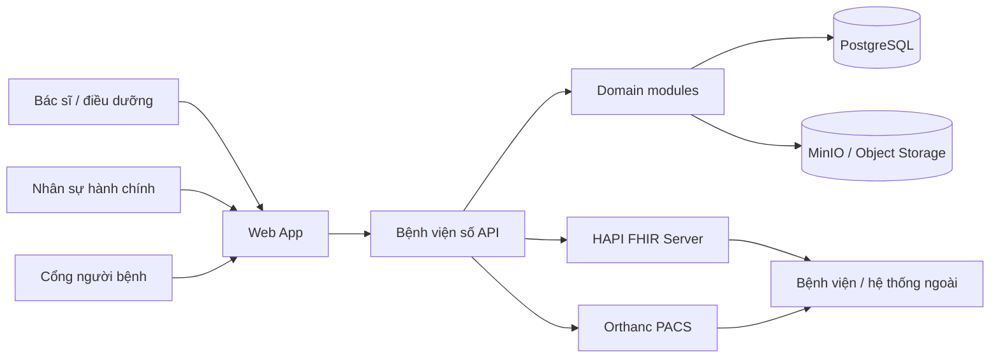
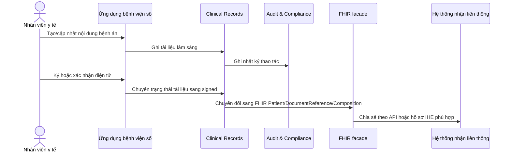

# Kiến trúc hệ thống

## Mục tiêu

Dự án hướng tới một nền tảng bệnh án điện tử có thể giải thích rõ trong bối cảnh học thuật, đồng thời đủ thực tế để mở rộng thành hệ thống thí nghiệm nghiêm túc. Trọng tâm không phải là “làm một HIS hoàn chỉnh ngay lập tức”, mà là xây phần lõi EMR/EHR có khả năng liên thông với HIS, LIS, PACS và các hệ thống bên ngoài.

## Lựa chọn kiến trúc khởi đầu

Kiến trúc khởi đầu là **modular monolith theo DDD**. Lý do:

- Dự án còn ở giai đoạn khám phá, chưa nên trả chi phí vận hành của microservice quá sớm.
- Ranh giới nghiệp vụ vẫn được tách rõ để sau này có thể tách service.
- Giao tiếp nội bộ trước mắt dùng module boundary trong mã nguồn; giao tiếp liên thông bên ngoài dùng API và chuẩn FHIR.
- Các thành phần hạ tầng như HAPI FHIR, Orthanc, PostgreSQL, Redis/Valkey và MinIO được để trong `infra/` như môi trường thử nghiệm, không tự bật.

## Bounded context

| Context | Vai trò | Có thể tách service khi nào |
| --- | --- | --- |
| Identity & Access | Người dùng, vai trò, quyền truy cập, phiên đăng nhập | Khi cần SSO, tích hợp định danh ngoài hoặc nhiều ứng dụng dùng chung |
| Patient Registry | Hồ sơ hành chính, định danh bệnh nhân, đối soát mã bệnh nhân | Khi cần liên thông nhiều bệnh viện hoặc master patient index |
| Clinical Records | Bệnh án, chẩn đoán, y lệnh, diễn biến, tài liệu lâm sàng | Khi khối lượng tài liệu và quy trình ký/xác nhận tăng |
| Interoperability | FHIR facade, mapping dữ liệu, luồng gửi/nhận tài liệu | Khi kết nối nhiều chuẩn và nhiều đối tác |
| Imaging | Tích hợp PACS, DICOM/DICOMweb, báo cáo hình ảnh | Khi dữ liệu ảnh lớn hoặc cần quản trị riêng |
| Audit & Compliance | Nhật ký truy cập, nhật ký chỉnh sửa, báo cáo tuân thủ | Khi có yêu cầu kiểm toán độc lập |

## Sơ đồ tổng quan

## Luồng bệnh án điện tử ở mức khái niệm

## Nguyên tắc dữ liệu

- **Không coi FHIR là database nội bộ duy nhất.** FHIR là lớp trao đổi và liên thông; domain model vẫn giữ ngữ nghĩa nghiệp vụ của hệ thống.
- **Không coi một mã bệnh nhân là đủ.** Cần quản lý nhiều định danh: mã bệnh viện, số định danh cá nhân, mã bảo hiểm y tế, mã hệ thống cũ.
- **Tài liệu bệnh án cần có vòng đời.** Tối thiểu gồm nháp, đã ký, bị thay thế, nhập sai.
- **Ảnh y khoa đi theo chuẩn riêng.** Ảnh X-quang, CT, MRI, siêu âm nên đi qua PACS/DICOM, không nhồi trực tiếp vào bảng bệnh án.
- **Mọi truy cập nhạy cảm cần kiểm toán.** Bệnh án là dữ liệu đặc biệt nhạy cảm, không thể thiếu audit trail.

## Luồng mở rộng dự kiến

1. Hoàn thiện registry bệnh nhân và tài liệu lâm sàng tối thiểu.
2. Kết nối HAPI FHIR để xuất/nhập `Patient`, `Encounter`, `Observation`, `Condition`, `DocumentReference`, `Composition`.
3. Kết nối Orthanc để minh họa PACS/DICOM và DICOMweb.
4. Bổ sung xác thực, phân quyền, nhật ký kiểm toán và chính sách lưu trữ.
5. Nếu cần mở rộng lớn, tách `Interoperability`, `Imaging`, `Audit` thành service riêng.

